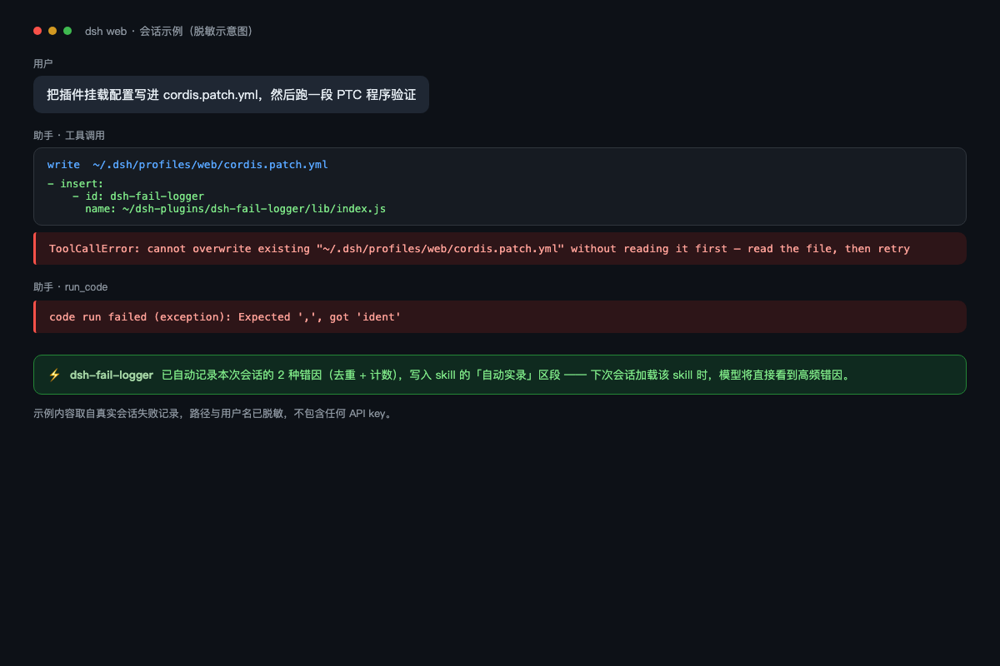
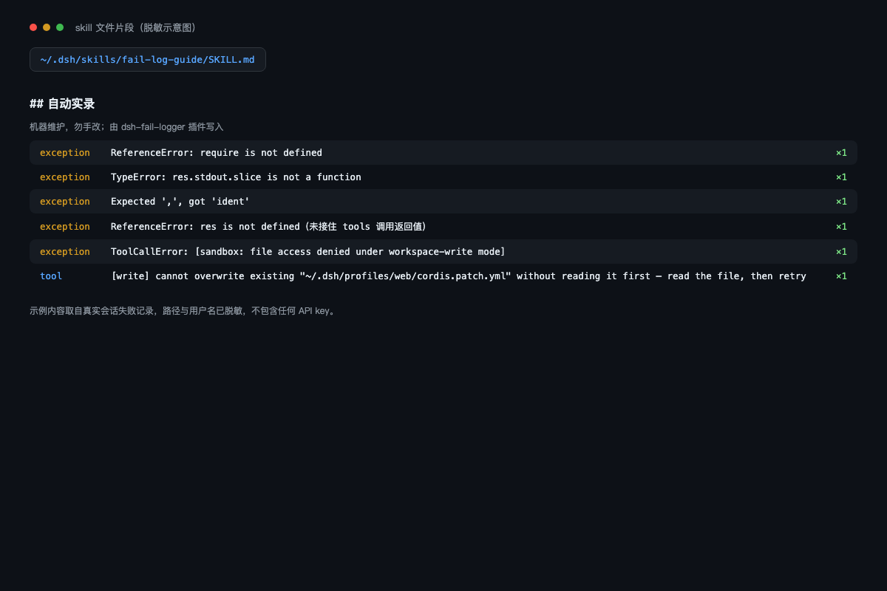

# dsh-fail-logger

全模式工具失败自动实录器：无论 DeepSeek Harness 跑在**原生模式**还是 **PTC（Code Mode）**，工具一旦失败，插件就把错因自动写进 skill 的机器维护区段（按错因去重、计数、确定性排序、有界裁剪），下次会话模型加载 skill 时直接看到高频错因——**错误越记越少**。

## 覆盖矩阵

| 执行模式 | 失败来源 | 记录格式（kind / message） |
|---|---|---|
| 原生工具（bash/read/edit/web_search/第三方插件工具…） | `tool/call` + `tool/result`（isError） | `tool` / `[bash] EPERM: operation not permitted …` |
| PTC `run_code` 整体失败 | `tool/result`（isError） | 官方 kind（`exception`/`timeout`/`abort`/…） / 原始错误消息 |
| PTC 程序内嵌工具失败（`tools.*` 调用抛错） | `tool/code-dispatch`（isError） | `tool` / `[read] ENOENT: no such file …` |

观测点是**会话日志**（`session/event`）——与官方遥测插件完全相同的挂点，纯观察者：不注入任何服务、不包装任何运行时、绝不影响模型执行。

## 效果

```
<!-- FAIL-LOG:BEGIN -->
## 自动实录（机器维护，勿手改；由 dsh-fail-logger 插件写入）

- [exception] ReferenceError: require is not defined — ×3（最近 2026-08-14 02:00）
- [tool] [bash] EPERM: operation not permitted, open '/Users/me/.dsh/x' — ×2（最近 2026-08-14 02:00）
- [timeout] compute budget exhausted (60000ms busy) — ×1（最近 2026-08-14 02:00）
<!-- FAIL-LOG:END -->
```

| 会话中的失败（自动捕获） | skill 的自动实录区段 |
|:---:|:---:|
|  |  |

*（脱敏示意图：内容取自真实会话失败记录，路径与用户名已用占位符替换，并已用视觉模型核验无 API key 等敏感信息）*

## 安装

```sh
dsh plugin --profile web add "github:<你的用户名>/dsh-fail-logger"
# 或已发布 npm 后：
# dsh plugin --profile web add dsh-fail-logger
# 或手动挂载：把 cordis.patch.yml 的 insert 条目加进 ~/.dsh/profiles/web/cordis.patch.yml
```

重启 `dsh --profile web` 生效（零配置开箱即用）。headless 同理：`dsh plugin --profile headless add …`。

## 配置（patch 条目 `config:`，全部可选）

```yaml
- insert:
    - id: dsh-fail-logger
      name: 'dsh-fail-logger'
      config:
        logDir: /Users/me/.dsh/skills/fail-log-guide  # 记录目标 skill 目录（默认配套 fail-log-guide）
        maxEntries: 10    # 实录区段最多行数
        maxMsg: 200       # 每条消息保留字符数
        marker: FAIL-LOG  # 区段标记 id（[A-Za-z0-9-]）
        flushMs: 300      # 失败风暴合并写防抖窗口
```

## 工作原理

- 监听 `session/event`，只消费三类事件：`tool/call`（建立 callId→工具名映射，容量 2048）、`tool/result`（isError 为真才记录）、`tool/code-dispatch`（isError 为真才记录）；
- `run_code` 的失败文本会解析出官方 `CodeRunFailure.kind` 与原始消息，与其他工具（带 `[工具名]` 前缀）分列记录；
- SHA1(kind + 首行消息) 去重；同错因只记一条、次数递增；排序为确定性全序（count↓ → last↓ → first↓ → hash↑）；
- 状态存 `.failures.json` 并超 `maxEntries×5` 自动裁剪；区段写入 SKILL.md 的 `<!-- …:BEGIN/END -->` 标记之间，多区段自动折叠、残缺标记自动归位；
- 所有落盘为原子写（tmp + rename），状态损坏先备份 `.bak-<时间戳>` 再重置。

## 已知限制

- **只记录到达会话日志的失败**：工具执行过程中进程崩溃等无法产生 `tool/result` 的极端失败不在覆盖范围。
- **跨进程计数为尽力而为**：web 与 headless 同时挂载时各自持有内存计数；原子写保证文件绝不损坏，极端情况下可能互相覆盖一次增量——错因内容不会丢，仅计数精度受影响。
- **状态损坏自动备份**：`.failures.json` 解析失败时重命名为 `.failures.json.bak-<时间戳>` 后重置。

## 与社区同类插件的区别

- `distill`（对话蒸馏成技能）、`dsh-skillport`（技能库导入）：**主动**生成/导入技能；本插件是**被动**记录运行事实，互补。
- `dsh-trace` / `dsh-telemetry-redactor`（遥测导出到外部平台）：面向外部可观测性；本插件面向**本地技能自愈**，不开任何外部通道。
- `dsh-notify`（错误通知）：只提醒；本插件沉淀为可检索的长期记忆。

## 开发与测试

```sh
npm run check   # node --check lib/index.js
npm test        # 10 组单元测试：全模式事件解析/去重/裁剪/损坏恢复/标记归位/防抖/dispose 直刷
```

## License

MIT